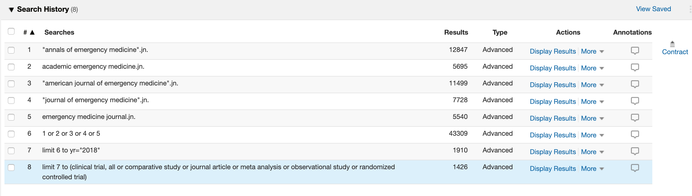

This is an html rendering of an [R Markdown](http://rmarkdown.rstudio.com) Notebook. When you execute code within the notebook, the results appear beneath the code. For the purposes of this paper we will provide a more in depth analysis of the open science practices within the selected emergency medicine journals.


```r
# Initial import of required packages
require(tidyverse)
require(readxl)
require(knitr)
require(kableExtra)
```


We initially performed an Ovid Seach to identify all the articles from 2018 for the selected journals.



Two reviewers (KD & TP) then reviewed all articles for reference to open code and open data practices. Articles were considered to have open code and/or open data if references to the sources were provided (e.g. github, public repository url). Reviewers additionally recorded information on code language type (e.g. R, STATA), name of public data sets. A sample of 20 articles were reviewed by both reviewers to determine a kappa statistic for agreement.

#### Presentation of Raw Data

```r
# automated generation of table of raw data used in analysis
df <- read_excel("../data/journal_articles_mod.xls", sheet=1)
kable(head(df)) %>%
  kable_styling(bootstrap_options = c("striped", "hover", "condensed"), font_size = 7) %>%
  scroll_box(width = "100%", height = "200px")
```

<div style="border: 1px solid #ddd; padding: 0px; overflow-y: scroll; height:200px; overflow-x: scroll; width:100%; "><table class="table table-striped table-hover table-condensed" style="font-size: 7px; margin-left: auto; margin-right: auto;">
 <thead>
  <tr>
   <th style="text-align:left;position: sticky; top:0; background-color: #FFFFFF;"> TI </th>
   <th style="text-align:left;position: sticky; top:0; background-color: #FFFFFF;"> SO </th>
   <th style="text-align:left;position: sticky; top:0; background-color: #FFFFFF;"> IO </th>
   <th style="text-align:left;position: sticky; top:0; background-color: #FFFFFF;"> PM </th>
   <th style="text-align:left;position: sticky; top:0; background-color: #FFFFFF;"> AB </th>
   <th style="text-align:left;position: sticky; top:0; background-color: #FFFFFF;"> DO </th>
   <th style="text-align:left;position: sticky; top:0; background-color: #FFFFFF;"> PT </th>
   <th style="text-align:left;position: sticky; top:0; background-color: #FFFFFF;"> FTURL </th>
   <th style="text-align:left;position: sticky; top:0; background-color: #FFFFFF;"> open_code_yn </th>
   <th style="text-align:left;position: sticky; top:0; background-color: #FFFFFF;"> open_data_yn </th>
   <th style="text-align:left;position: sticky; top:0; background-color: #FFFFFF;"> public_data_set </th>
   <th style="text-align:left;position: sticky; top:0; background-color: #FFFFFF;"> data_avail </th>
   <th style="text-align:left;position: sticky; top:0; background-color: #FFFFFF;"> code_avail </th>
   <th style="text-align:left;position: sticky; top:0; background-color: #FFFFFF;"> reviewer </th>
   <th style="text-align:left;position: sticky; top:0; background-color: #FFFFFF;"> notes </th>
   <th style="text-align:left;position: sticky; top:0; background-color: #FFFFFF;"> Flag for Review </th>
  </tr>
 </thead>
<tbody>
  <tr>
   <td style="text-align:left;"> Outcomes of Patients With Syncope and Suspected Dementia. </td>
   <td style="text-align:left;"> Academic Emergency Medicine.  2018 Mar 25 </td>
   <td style="text-align:left;"> Acad Emerg Med </td>
   <td style="text-align:left;"> https://www.ncbi.nlm.nih.gov/pmc/articles/PMC6156993 </td>
   <td style="text-align:left;"> OBJECTIVES: Syncope and near-syncope are common in patients with dementia and a leading cause of emergency department (ED) evaluation and subsequent hospitalization. The objective of this study was to describe the clinical trajectory and short-term outcomes of patients who presented to the ED with syncope or near-syncope and were assessed by their ED provider to have dementia.

METHODS: This multisite prospective cohort study included patients 60 years of age or older who presented to the ED with syncope or near-syncope between 2013 and 2016. We analyzed a subcohort of 279 patients who were identified by the treating ED provider to have baseline dementia. We collected comprehensive patient-level, utilization, and outcomes data through interviews, provider surveys, and chart abstraction. Outcome measures included serious conditions related to syncope and death.

RESULTS: Overall, 221 patients (79%) were hospitalized with a median length of stay of 2.1 days. A total of 46 patients (16%) were diagnosed with a serious condition in the ED. Of the 179 hospitalized patients who did not have a serious condition identified in the ED, 14 (7.8%) were subsequently diagnosed with a serious condition during the hospitalization, and an additional 12 patients (6.7%) were diagnosed postdischarge within 30 days of the index ED visit. There were seven deaths (2.5%) overall, none of which were cardiac-related. No patients who were discharged from the ED died or had a serious condition in the subsequent 30 days.

CONCLUSIONS: Patients with perceived dementia who presented to the ED with syncope or near-syncope were frequently hospitalized. The diagnosis of a serious condition was uncommon if not identified during the initial ED assessment. Given the known iatrogenic risks of hospitalization for patients with dementia, future investigation of the impact of goals of care discussions on reducing potentially preventable, futile, or unwanted hospitalizations while improving goal-concordant care is warranted. Copyright © 2018 by the Society for Academic Emergency Medicine. </td>
   <td style="text-align:left;"> https://dx.doi.org/10.1111/acem.13414 </td>
   <td style="text-align:left;"> Journal Article </td>
   <td style="text-align:left;"> Click here for full text options </td>
   <td style="text-align:left;"> N </td>
   <td style="text-align:left;"> N </td>
   <td style="text-align:left;"> N </td>
   <td style="text-align:left;"> N </td>
   <td style="text-align:left;"> N </td>
   <td style="text-align:left;"> KD </td>
   <td style="text-align:left;"> Used 11 academic EDs across the US, coded in R </td>
   <td style="text-align:left;"> NA </td>
  </tr>
  <tr>
   <td style="text-align:left;"> Impact of Jahnigen/GEMSSTAR Scholarships on Careers of Recipients in Emergency Medicine and on Development of Geriatric Emergency Medicine. </td>
   <td style="text-align:left;"> Academic Emergency Medicine.  2018 Mar 01 </td>
   <td style="text-align:left;"> Acad Emerg Med </td>
   <td style="text-align:left;"> https://www.ncbi.nlm.nih.gov/pmc/articles/PMC6119536 </td>
   <td style="text-align:left;"> BACKGROUND: The Jahnigen Career Development Awards program was launched in 2002 with private funding and transformed into the Grants for Early Medical/Surgical Specialists' Transition to Aging Research (GEMSSTAR) program in 2011 through support from the National Institute on Aging and medical specialty professional societies. The Jahnigen/GEMSSTAR program has provided grants to early career physician-scientists from 10 surgical and related medical specialties to initiate and sustain research careers in the geriatric aspect of their discipline. From 2002 to 2016, there were 20 Jahnigen/GEMSSTAR recipients in emergency medicine (EM). The goal of this investigation was to examine the impact of Jahnigen/GEMSSTAR awards on careers of EM recipients and on development of academic geriatric EM.

METHODS: We conducted an online survey of the 20 EM recipients from 2002 to 2016 and analyzed their academic productivity, research impact, career trajectory, and contributions to geriatric EM since receiving the award.

RESULTS: All 20 Jahnigen/GEMSSTAR scholars completed the survey. Scholars have published a median of 33 peer-reviewed articles (interquartile range [IQR] = 10-97) since the award, with median annual publication rates of 4.5 (IQR = 1.6-7.0). All scholars had h-indices of 6 or more, with a median of 18 (IQR = 9-28). Jahnigen/GEMSSTAR scholars have served as principal investigator (PI) or co-PI on 126 grants since their award, with 90% having served as PI on at least one additional grant and 30% having received National Institutes of Health Career Development Awards. All scholars reported believing that the Jahnigen/GEMSSTAR was very helpful or helpful for career progress. Most (85%) reported ongoing contributions to geriatric EM in research, education, or administration.

CONCLUSIONS: After the Jahnigen/GEMSSTAR award, EM scholars have been highly academically productive and successful, and the award has been instrumental in their career development. Awardees have been critical to the development of geriatric EM. Copyright © 2018 by the Society for Academic Emergency Medicine. </td>
   <td style="text-align:left;"> https://dx.doi.org/10.1111/acem.13396 </td>
   <td style="text-align:left;"> Journal Article </td>
   <td style="text-align:left;"> Click here for full text options </td>
   <td style="text-align:left;"> N </td>
   <td style="text-align:left;"> N </td>
   <td style="text-align:left;"> N </td>
   <td style="text-align:left;"> N </td>
   <td style="text-align:left;"> N </td>
   <td style="text-align:left;"> KD </td>
   <td style="text-align:left;"> Survey data </td>
   <td style="text-align:left;"> NA </td>
  </tr>
  <tr>
   <td style="text-align:left;"> A comparative analysis of National Institutes of Health research support for emergency medicine - 2008 to 2017. </td>
   <td style="text-align:left;"> American Journal of Emergency Medicine.  2018 Dec 26 </td>
   <td style="text-align:left;"> Am J Emerg Med </td>
   <td style="text-align:left;"> https://www.ncbi.nlm.nih.gov/pmc/articles/PMC6594913 </td>
   <td style="text-align:left;"> OBJECTIVES: We sought to compare National Institutes of Health (NIH) funding received by Emergency Medicine (EM) to the specialties of Family Medicine, Neurology, Orthopedics, Pediatrics and Psychiatry over the 10-year period from 2008 to 2017.

METHODS: The NIH database of both submitted and funded NIH applications were queried and crossed with the departmental affiliation of the principal investigator. Research Grants were defined by the following activity codes: R, P, M, S, K, U (excluding UC6), DP1, DP2, DP3, DP4, DP5, D42 and G12. Derived data were further analyzed using information from the Association of American Medical Colleges to determine the relationship between the number of awards and the size of respective teaching and research faculty.

RESULTS: From 2008 to 2017, there were a total of 14,676 funded grants across included specialties with total monetary support of $6.002 billion. Of these funded grants, 250 (1.7%) were from EM principal investigators which corresponded to total support of $89,453,635 (1.5% of overall dollars). There was an increase in total support after 2012 in EM, however when compared to the other specialties, EM investigators submitted relatively fewer grants and awarded grants were funded by a wider distribution of NIH Institutes and Centers (ICs).

CONCLUSIONS: Compared to other select specialties, EM investigators accounted for a small proportion of grants submitted and funded over the past decade. Though findings illustrate promising trends, to foster success, more submitted grant applications are needed from within EM along with systematic approaches to support faculty members in their pursuit of NIH funding. Copyright © 2018 Elsevier Inc. All rights reserved. </td>
   <td style="text-align:left;"> https://dx.doi.org/10.1016/j.ajem.2018.12.045 </td>
   <td style="text-align:left;"> Journal Article </td>
   <td style="text-align:left;"> Click here for full text options </td>
   <td style="text-align:left;"> N </td>
   <td style="text-align:left;"> N </td>
   <td style="text-align:left;"> N </td>
   <td style="text-align:left;"> N </td>
   <td style="text-align:left;"> N </td>
   <td style="text-align:left;"> KD </td>
   <td style="text-align:left;"> Data set is federal Query/View/Report (QVR) database, limited to Health &amp; Human Resources staff with log-in access; SAS statistical software </td>
   <td style="text-align:left;"> NA </td>
  </tr>
  <tr>
   <td style="text-align:left;"> WITHDRAWN: Relocation of blood gas laboratory to the emergency department helps decrease lactic acid values. </td>
   <td style="text-align:left;"> American Journal of Emergency Medicine.  2018 Mar 20 </td>
   <td style="text-align:left;"> Am J Emerg Med </td>
   <td style="text-align:left;"> NA </td>
   <td style="text-align:left;"> The Publisher regrets that this article is an accidental duplication of an article that has already been published, http://dx.doi.org/10.1016/j.ajem.2018.03.017. The duplicate article has therefore been withdrawn. The full Elsevier Policy on Article Withdrawal can be found at https://www.elsevier.com/about/our-business/policies/article-withdrawal. Copyright © 2018 Elsevier Ltd. All rights reserved. </td>
   <td style="text-align:left;"> https://dx.doi.org/10.1016/j.ajem.2018.03.042 </td>
   <td style="text-align:left;"> Journal Article </td>
   <td style="text-align:left;"> Click here for full text options </td>
   <td style="text-align:left;"> N </td>
   <td style="text-align:left;"> N </td>
   <td style="text-align:left;"> N </td>
   <td style="text-align:left;"> N </td>
   <td style="text-align:left;"> N </td>
   <td style="text-align:left;"> KD </td>
   <td style="text-align:left;"> NA </td>
   <td style="text-align:left;"> NA </td>
  </tr>
  <tr>
   <td style="text-align:left;"> Management and outcome of obstructive ureteral stones in the emergency department: Emphasis on urine tests and antibiotics usage. </td>
   <td style="text-align:left;"> American Journal of Emergency Medicine.  2018 Dec 24 </td>
   <td style="text-align:left;"> Am J Emerg Med </td>
   <td style="text-align:left;"> NA </td>
   <td style="text-align:left;"> BACKGROUND: Kidney stone related complaints in the Emergency Department (ED) are common. Current guidelines recommend antibiotic therapy for infected obstructive stones and stone removal in a timely fashion, but there is no clear recommendation for prophylactic antibiotic use for bacteriuria or pyuria in the setting of obstructive ureteral stones.

OBJECTIVES: The aim of this study is to evaluate the current management of patients with obstructive ureteral stones in a single ED with emphasis on urine tests and antibiotics use.

METHODS: The picture archiving and communication system (PACS) was used to filter the list of patients who received a computed tomography (CT) scan of the abdomen and pelvis that positively identified obstructive ureteral stones. Demographics and clinical data were also recorded and analyzed.

RESULTS: Of the patients discharged, 278 patients did not receive antibiotics in the ED or a prescription. Of these, 8 patients had positive culture, 4 patients followed up, and one developed and was treated for a urinary-tract infection. One hundred ninety two patients were not given antibiotics in the ED but received an antibiotics prescription, and 4 patients had positive cultures grow. Two followed up and had no infection-related complications. Fourteen patients were discharged without a prescription after receiving a single dose of antibiotics in the ED, with no positive urine cultures and 9 patients following up without complication.

CONCLUSION: Antibiotics were given at the discretion of the provider without clear pattern. A high rate of infectious complication did not occur in the followed up patient group. Copyright © 2018. Published by Elsevier Inc. </td>
   <td style="text-align:left;"> https://dx.doi.org/10.1016/j.ajem.2018.12.046 </td>
   <td style="text-align:left;"> Journal Article </td>
   <td style="text-align:left;"> Click here for full text options </td>
   <td style="text-align:left;"> N </td>
   <td style="text-align:left;"> N </td>
   <td style="text-align:left;"> N </td>
   <td style="text-align:left;"> N </td>
   <td style="text-align:left;"> N </td>
   <td style="text-align:left;"> KD </td>
   <td style="text-align:left;"> Picture archiving and communication system (PACS), EMRs </td>
   <td style="text-align:left;"> NA </td>
  </tr>
  <tr>
   <td style="text-align:left;"> Beyond observation: Protocols and capabilities of an Emergency Department Observation Unit. </td>
   <td style="text-align:left;"> American Journal of Emergency Medicine.  2018 Dec 27 </td>
   <td style="text-align:left;"> Am J Emerg Med </td>
   <td style="text-align:left;"> NA </td>
   <td style="text-align:left;"> OBJECTIVE: Emergency Department Observation Units (Obs Units) provide a setting and a mechanism for further care of Emergency Department (ED) patients. Our hospital has a protocol-driven, type 1, complex 20 bed Obs Unit with 36 different protocols. We wanted to understand how the different protocols performed and what types of care were provided.

METHODS: This was an IRB-approved, retrospective chart review study. A random 10% of ED patient charts with a "transfer to observation" order were selected monthly from October 2015 through June 2017. This database was designed to identify high and low functioning protocols based on length of stays (LOS) and admission rates.

RESULTS: Over 20months, a total of 984 patients qualified for the study. The average age was 49.5+/-17.2years, 57.3% were women, and 32.3% were non-Caucasian. The admission rate was 23.5% with an average LOS in observation of 13.7h [95% CI 13.3-14.1]. Thirty day return rate was 16.8% with 5.3% of the patients returning to the ED within the first 72h. Thirty six different protocols were used, with the most common being chest pain (13.9%) and general (13.2%). Almost 70% received a consultation from another service, and 7.2% required a procedure while in observation. Procedures included fluoroscopic-guided lumbar punctures, endoscopies, dental extractions, and catheter replacements (nephrostomy, gastrostomy, and biliary tubes).

CONCLUSIONS: An Obs Unit can care for a wide variety of patients who require multiple consultations, procedures, and care coordination while maintaining an acceptable length of stay and admission rate. Copyright © 2019. Published by Elsevier Inc. </td>
   <td style="text-align:left;"> https://dx.doi.org/10.1016/j.ajem.2018.12.049 </td>
   <td style="text-align:left;"> Journal Article </td>
   <td style="text-align:left;"> Click here for full text options </td>
   <td style="text-align:left;"> N </td>
   <td style="text-align:left;"> N </td>
   <td style="text-align:left;"> N </td>
   <td style="text-align:left;"> N </td>
   <td style="text-align:left;"> N </td>
   <td style="text-align:left;"> KD </td>
   <td style="text-align:left;"> EPIC </td>
   <td style="text-align:left;"> NA </td>
  </tr>
</tbody>
</table></div>

The total number of intial articles was 1426

#### Data Cleaning
Articles were filtered for primary journal articles by Ovid listed journal type
and through manual review

```r
# Filter articles further for only primary journal articles 
df <- df %>%
  filter((open_code_yn == "Y" | open_code_yn == "N"))
```

The total number of filtered articles was 643


#### Further Analysis
The number of articles with open code, open data, etc. are presented below


```r
df %>%
  select(open_code_yn:code_avail) %>%
  gather(key, value) %>%
  mutate(value = ifelse(value == 'N', 0, 1)) %>%
  xtabs(value ~ key, data = .)
```

```
## key
##      code_avail      data_avail    open_code_yn    open_data_yn public_data_set 
##               1              13               0               2              54
```


Review of Top Standards for Emergency Medicine Journals.


