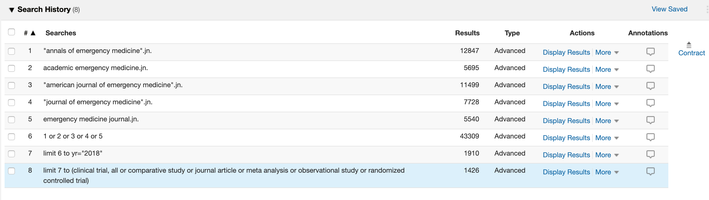

This is an [R Markdown](http://rmarkdown.rstudio.com) Notebook. When you execute code within the notebook, the results appear beneath the code. For the purposes of this paper we will provide a more in depth analysis of the open science practices within the selected emergency medicine journals

```{r setup_show,  eval=FALSE}
# Initial import of required packages
require(tidyverse)
require(readxl)
require(knitr)
require(kableExtra)
```


```{r setup,  include=FALSE}
# Initial import of required packages
require(tidyverse)
require(readxl)
require(knitr)
require(kableExtra)
```


We initially performed an Ovid Seach to identify all the articles from 2018 for the selected journals.



Two reviewers (KD & TP) then reviewed all articles for reference to open code and open data practices. Articles were considered to have open code and/or open data if references to the sources were provided (e.g. github, public repository url). Reviewers additional recorded informration on code language type (e.g. R, STATA), name of public data sets, and whether the data and code were available. TA sample of XX articles were reviewed by both reviewers to determine a kappa statistic for agreement.

#### Presentation of Raw Data
```{r}
# automated generation of table of raw data used in analysis
df <- read_excel("../data/journal_articles_mod.xls", sheet=1)
kable(head(df)) %>%
  kable_styling(bootstrap_options = c("striped", "hover", "condensed"), font_size = 7) %>%
  scroll_box(width = "100%", height = "200px")
```

The total number of intial charts was `r nrow(df) `

#### Data Cleaning
Articles were filtered for primary journal articles by Ovid Listed Journal Type
and Reviewers
```{r}
# Filter articles further for only primary journal articles 
df <- df %>%
  filter((open_code_yn == "Y" | open_code_yn == "N"))

```

The total number of filtered charts was `r nrow(df) `

```{r}
df %>%
  select(open_code_yn:code_avail) %>%
  gather(key, value) %>%
  mutate(value = ifelse(value == 'N', 0, 1)) %>%
  xtabs(value ~ key, data = .)
```


